## Introduction 
### CyberSecurity Mindset
Welcome to Cybersecurity Mindset blog! Here, you'll find the latest insights, tips, and news to help you stay safe in the digital world. Whether you're a seasoned professional or just starting your journey in cybersecurity, our content is designed to inform and empower you. Join us as we explore the ever-evolving landscape of cyber threats and defenses. Stay informed, stay secure!

Our focus and goal is to provide comprehensive and up-to-date information on a wide range of cybersecurity topics

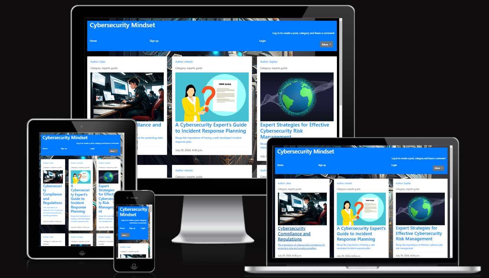

Link to live website: [CLICK HERE!](https://cybersecurity-blog-c42a16cdf7ab.herokuapp.com/about_page/)

## Table of contents
  - [Introduction](#Introduction)
  - [Overview](#Overview)
  - [UX-User-Experience](#UX-User-Experience)
   - [Structural plane](#Structural-plane)
  - [Design Aesthetic](#Design-Aesthetic)
    - [Colour Scheme](#Colour-Scheme)
    - [Typography](#Typography)
    - [Visual Elements](#Visual-Elements)

- [Project planning](#Project-planning) 
  - [Agile methodology project Management with Github](#gile-methodology-project-Management-with-Github) 
     - [Repositories](#Repositories)
     - [Issues and story points allocation](#Issues-and-story-points-allocation)
     - [MoSCoW Prioritisation](#MoSCoW-Prioritisation) 
     - [Project Boards](#Project-Boards)
     - [milestones](#milestones)
     - [user stories](#user-stories)
     - [Epics](#Epics)
- [Scope plan](#Scope-plan)
- [Skeleton and surface](#Skeleton-and-surface) 
    - [wireframes](#wireframes)
- [Database Schema](#Database-Schema)
   - [Entity Relationship Diagram](#Entity-Relationship-Diagram)
   - [ERD Table overview](#ERD-Table-overview)
   - [Relationships](#Relationships)
- [Security](#Security)
   - [Data Encryption](#Data-Encryption)
   - [CSRF Tokens](#CSRF-Tokens)
   - [AllAuth](#AllAuth)
- [Features](#Features)
   - [Existing features](#Existing-features)
   - [functionality](#functionality)
   - [CRUD Functionality](#CRUD-Functionality)
- [Featue remaining to implement](#Featue-remaining-to-implement)
- [Technologies Used](#Technologies-Used)
-  [fontend](#fontend)
-  [backend](#backend)
-  [deployment](#deployment)
-  [version control](#version-control)
-  [development tools](#development-tools)
-  [libraries and frameworks](#libraries-and-frameworks)
-  [validation tools](#validation-tools)
-  [Testing](#Testing)
-  [Cloning and Forking](#Cloning-and-Forking)
-  [Credits](#Credits)         
     

## Overview 
Here's an overview of what you can expect:

1. Latest News and Trends: Stay informed about the latest developments in the world of cybersecurity. We cover breaking news, emerging threats, and the latest trends affecting the digital landscape.

2. Expert Insights: Gain valuable knowledge from industry experts. Our blog features articles, interviews, and opinion pieces from seasoned cybersecurity professionals.

3. Practical Tips and Guides: Learn how to protect yourself and your organization from cyber threats. We provide practical advice, step-by-step guides, and best practices for enhancing your security posture.

4. Threat Analysis: Understand the nature of various cyber threats. We delve into different types of attacks, their methodologies, and how to defend against them.

5. Product Reviews and Recommendations: Find reviews and recommendations for cybersecurity tools and software. We evaluate the latest products to help you make informed decisions.

6. Case Studies: Read real-world examples of cybersecurity incidents and their resolutions. These case studies offer insights into how organizations respond to and recover from cyberattacks.

7. Regulatory Updates: Keep up with changes in cybersecurity regulations and compliance requirements. We provide updates on relevant laws and standards that impact businesses and individuals.

8. Community Engagement: Join our community of cybersecurity enthusiasts. Engage in discussions, share your experiences, and connect with like-minded individuals.

We are committed to delivering high-quality content that educates, informs, and empowers our readers. Thank you for visiting, and we hope you find our blog both useful and engaging. Stay safe and secure!

## UX-User-Experience
The US design of Cybersecurity Mindset blog is a balance between an engaging, user-friendly interface and ensuring security best practices. Here's the UX design outline:
## Structural plane
### 1. Homepage

Header:
- The Logo is at the Top left corner.
- Followed by the Navigation Menu: Home, Signup/Login page
- The  About, Contact, Search (magnifying glass icon) is at the lower Top right corner.
- The Create-post, Create Category, and Log-out is seen when a user has logged in, this allowers access to only login users.

Hero Section:
- The Featured Articles Slider Highlights the latest or most important posts.
- The Search Bar is Prominent and centrally located for easy access.

Main Content:
- Shows a list view of recent Blog_posts with authors, titles, excerpts, publication dates and time.
- The read_more link takes user to the detailed articles for each blog_post

Footer:
- There are Quick Links to important pages.
- There are Social Media Link  Icons to my social media profiles.

 ### 2. Blog Post Page

Article Content:
- Title and Author Information: Displays the title and author's name.
- The Images: An image to compliment each blog post.
- Content Area: There is a Clean, readable font with ample spacing.
- Related Articles: Suggested reads based on the current post.
- publication date and time comes directly after the detailed article.
- Comment Section: Is Secured and moderated with the option for users to login to comment, update and delete their comments.

### 3. Create Category Page

- Category Header: Clear title and brief description of the category.
- Form: The form has input field for name of category.
- Pagination: For navigating back to the homepage.

### 4. About Page

- Mission Statement: The About page Briefly explains the blog’s purpose.
- Team Members: Display Photos of contributors.

### 5. Contact Page

- Contact Form: The Django Secure form is used for inquiries.
- A confirmation message is seen after the user has successfully sent out an inquiry.

### 6. Additional Features

Responsive Design:
- A responsive design is used to Ensure the site is fully functional and visually appealing on all devices, from desktops to smartphones, thanks to Django.

Accessibility:
- The site is accessible to users with disabilities, complying with WCAG standard.

## Design Aesthetic
- Color Scheme: A Professional and clean shades of blue, gray, black and white to convey trust and security.
- Typography: There is a Clear and readable fonts, with a good contrast against the background.
- Visual Elements: relevant and high-quality images is used to enhance content.

## Project planning

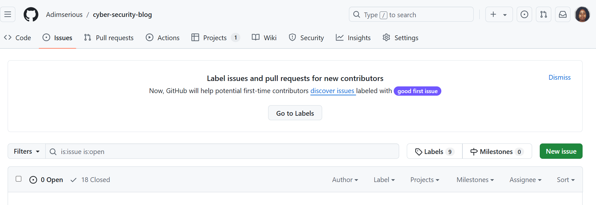

## Agile methodology project Management with Github 
CyberSecurity Mindset adopted the Agile methodology project Management with GitHub using GitHub's features which emphasize flexibility, collaboration, and iterative progress. Here's a comprehensive explanation of some of the features i used for the Cybersecurity Mindset blog to manage an agile project using GitHub:

### 1. Repositories

- Central Hub: Each project is stored in a GitHub repository, serving as the central hub for all project-related code, documentation, and resources.
- Version Control: GitHub provides version control, allowing teams to track changes, revert to previous versions, and collaborate efficiently on code.

### 2. Issues and story points allocation

- Task Tracking:  Issues in GitHub were used to track tasks, bugs, enhancements, and user stories. Each issue represents a piece of work that needs to be completed.
- Labels: labels are used to categorize issues by type (e.g., must have, could have, should have), priority, status (e.g., in-progress, done), and sprint.
- Assignees: Assign issues to team members to designate responsibility, in this project, it was only myself.

### 3. MoSCoW Prioritization 

1. Must have (M): These are critical requirements or tasks that are essential for the success of the project. Without these, the project would fail or be significantly compromised.

2. Should have (S): Important requirements or tasks that are not critical but have a high value. They are not absolutely necessary for the current project phase but should be included if possible.

3. Could have (C): Desirable requirements or tasks that would be beneficial if included but are not necessary. They can be deferred or dropped if time or resources are limited.

4. Won't have (W): These are the least critical requirements or tasks that will not be included in the current project phase but might be considered for future phases.

### 4. Project Boards 

- Kanban Boards: GitHub Projects provide kanban-style boards where issues can be organized into columns such as To Do, In Progress, and Done. This visualizes the workflow and progress of tasks.

### 5. Milestones

- Sprint Planning: milestones were used to represent sprints or releases. Each milestone had a due date and a collection of issues that need to be completed within the sprint even though there was room for adjustment, not fixed or sequencial.
- Progress Tracking: The progress of milestones were tracked by monitoring the number of completed issues versus the total number of issues.

- README: Each repository typically has a README file that provides an overview of the project, setup instructions, and other important information.

## user stories

User stories are a fundamental element of Agile development, focusing on the needs and experiences of end-users. They are short, simple descriptions of a feature told from the perspective of the person who desires the new capability, usually a user or customer of the system. Here is the link to the Cybersecurity Mindset user stories...

## Epics

An epic in Agile methodology is a large body of work that can be broken down into smaller tasks or user stories. Epics often span multiple sprints and sometimes even projects, providing a high-level view of significant features or functionalities. Here's a detailed overview of epics

## Scope plan

- *Purpose*: Cybersecurity Mindset aims to educate and raise awareness about cybersecurity threats, best practices, and technologies. Also aims to provide updates on the latest cybersecurity trends, news, and incidents as well as to share knowledge and help others develop their skills in cybersecurity.

### Target 

Audience Cybersecurity professionals, IT teams, tech-savvy readers General public, businesses, students, and professionals.

### Goal 
1. Increase the general public’s understanding of cybersecurity threats and best practices.
2. Keep readers informed about the latest developments, trends, and news in cybersecurity.
3. Create a space for like-minded individuals to connect, share knowledge, and discuss cybersecurity topics.
4. Provide resources and guidance for individuals seeking to advance their careers in cybersecurity.
5. Share knowledge and help others develop their skills in cybersecurity etc.

### User Needs
1. Access to update on the latest cybersecurity threats, trends, and news.
2. Ability to understand and implement cybersecurity best practices for personal or organizational security.
3. To advance their careers in cybersecurity through continuous learning and skill development.

## Skeleton and surface 
### Wireframes
[Figma]() was used to design the Cybersecurity Mindset

Home page Wireframe

Click to View Home Page wireframe

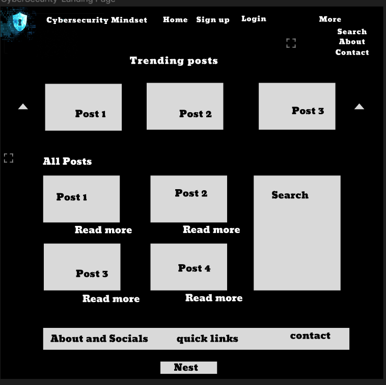

Read more wireframe

Click to View Read More wireframe

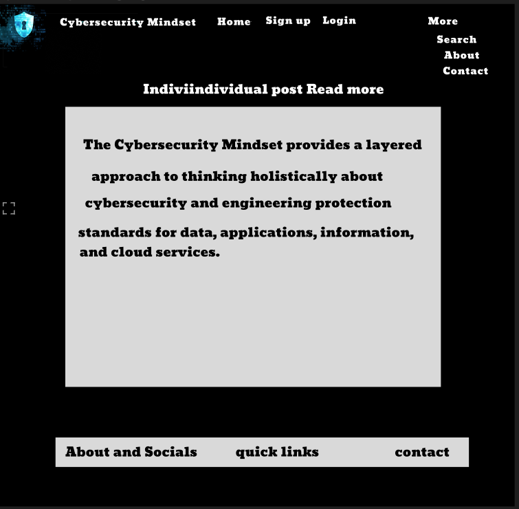

About page Wireframe

Click to View About Page wireframe

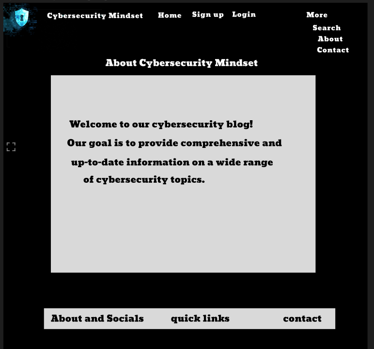

Contact page Wireframe

Click to View Contact Page wireframe

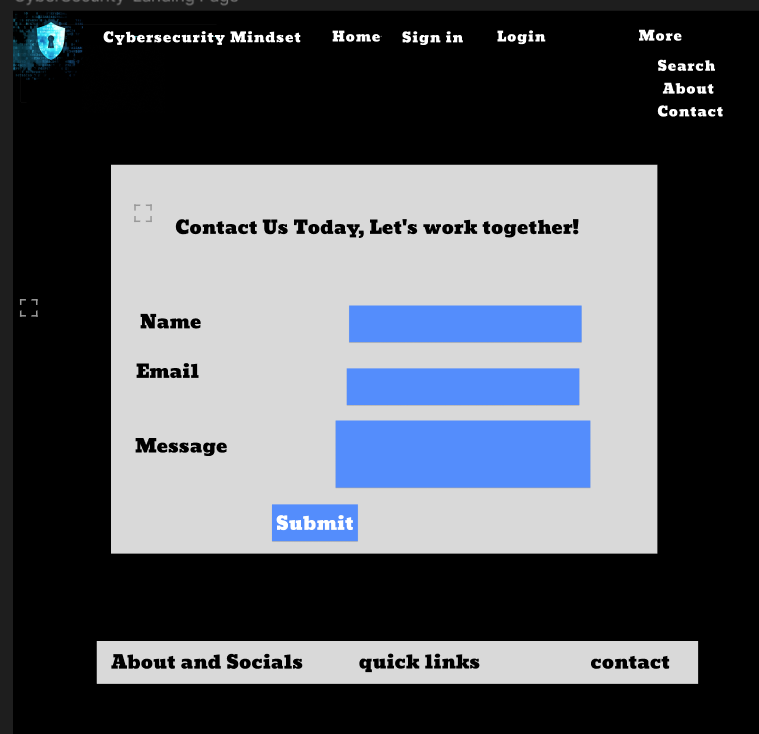

Create Post page Wireframe

Click to View Create Post Page wireframe

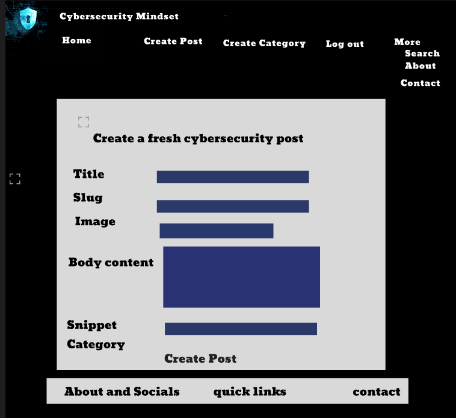

Sign up page Wireframe

Click to View Sign up Page wireframe

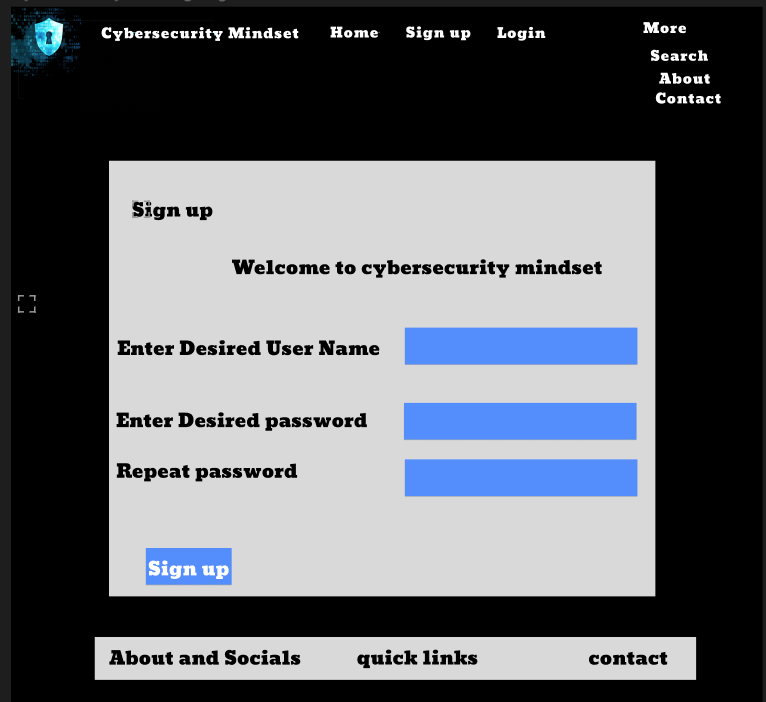

Sign in page Wireframe

Click to View Sign in Page wireframe

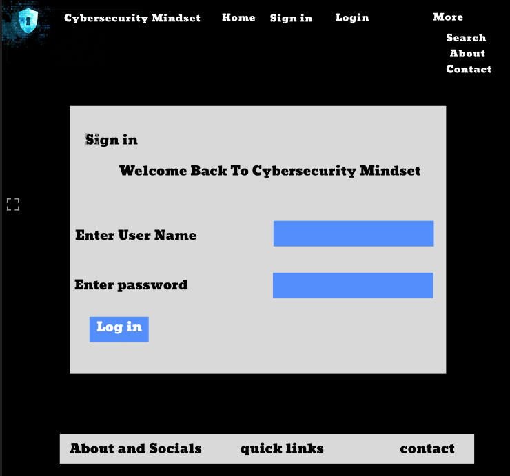

## Database Schema

A database schema is the blueprint or architecture of a database, defining how data is organized and how the relationships between data are managed. Here is an overview of the key database schema used in Cybersecurity Mindset

- Entity Relationship Diagram (ERD)
An Entity-Relationship Diagram (ERD) is a visual representation of the data and its relationships within a database. It is a critical tool in database design and modeling, helping to clarify the structure and organization of data. Here is an ERD diagram representation of the Cybersecurity Mindset.

## Tables Overview ERD

User:

Blog_post

Comment:

Category:

About_page

Contact:

## ERD Relationships 
 - *One-to-Many (1:M)*: A single entity instance in one entity is related to multiple instances in another entity.
 This relationship exists between User and Blog_post, where User can author many Blog_post

- Similarly, a one-to-many relationship is set between Blog_post and Comment, allowing multiple comments to be associated with a single Blog_post.

- The Category table is linked to the Blog_post table in a many-to-one relationship, categorizing many posts to one category.

- likes table ia linked to the Blog_post table in many-to-one relationship, where many likes can be associated with a single blog post

## Security
As with most things, Security is a critical aspect, especially for a platform Cybersecurity Mindset that handles user-generated content and personal data.

### Data Encryption
All sensitive data, including user passwords and personal information, are encrypted using robust encryption methods to protect against unauthorized access and breaches.

### CSRF Tokens
CSRF (Cross-Site Request Forgery) tokens are included in every form to help authenticate the request with the server when the form is submitted. Absence of these tokens can leave a site vulnerable to attackers who may steal users data and use them for malicious purposes.

### AllAuth
Django AllAuth is an installable framework that takes care of the user registration and authentication process. Authentication was needed to determine when a user have signed up or signed out which controlled what content was accessible on Cybersecurity Minset

## Features 
## Existing Features

#### Home Page
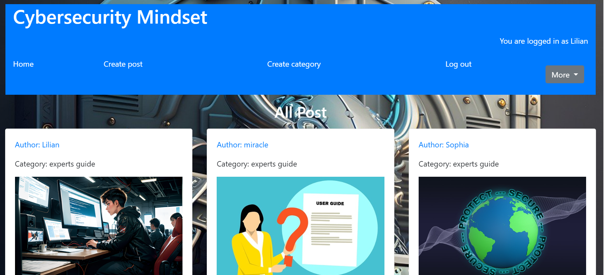

#### User Registration, Login, and Logout

  - New users can sign up by providing their username, email, and password. Existing users can log in using their credentials to access personalized features.

  **Registration/SignUp**
      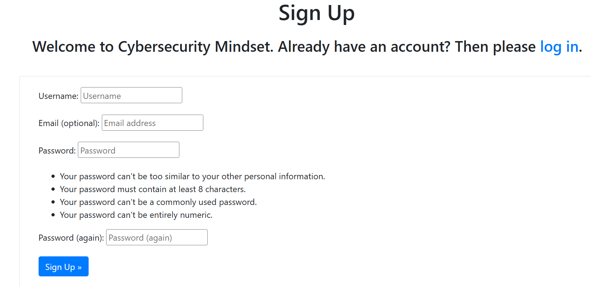

  **Login/SignIn**  
      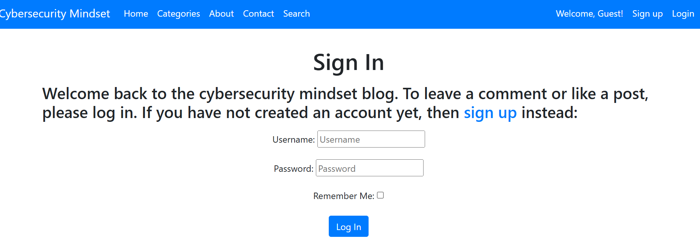

  **Logout/Signout**
      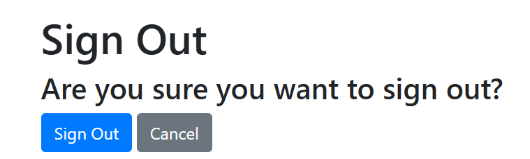

#### All Posts

  - Content creators can view their posts through 'All Posts'. They can view all their contributions, and every other existing Cybersecurity posts.

  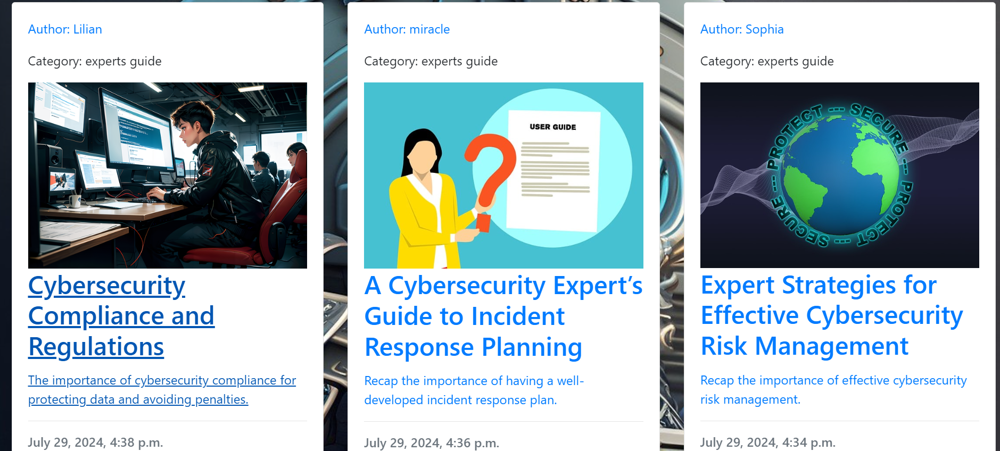

#### Create Post

  - Registered users can contribute by creating their own Cybersecurity posts. They can include a title, slug, images,body content, snippet and select categories for their Post.

  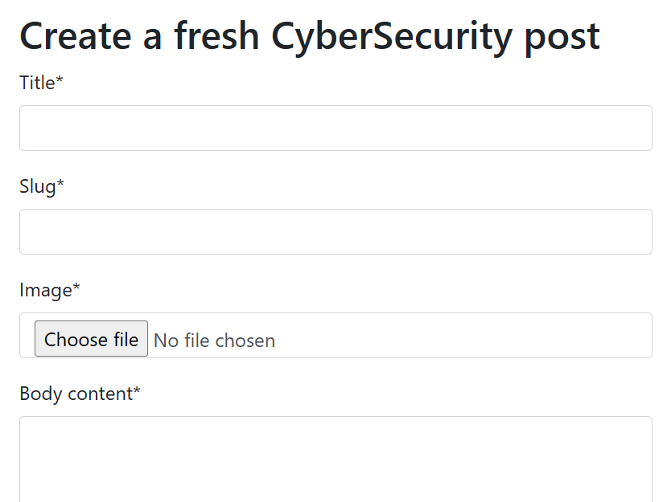

#### Read More

  - Users can read detailed views of each post, engage with content through likes, and comments.

  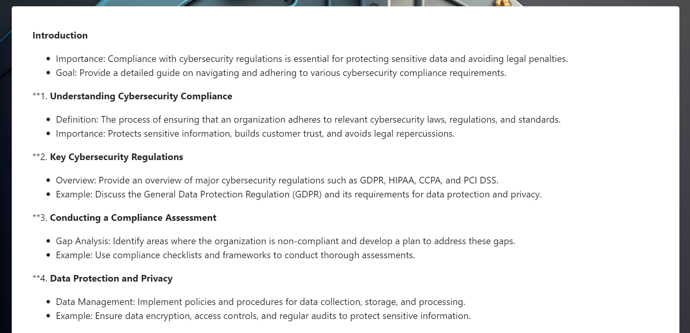

#### Comments 

  - Users can leave comments, engage in discussions, and provide feedback to authors.

  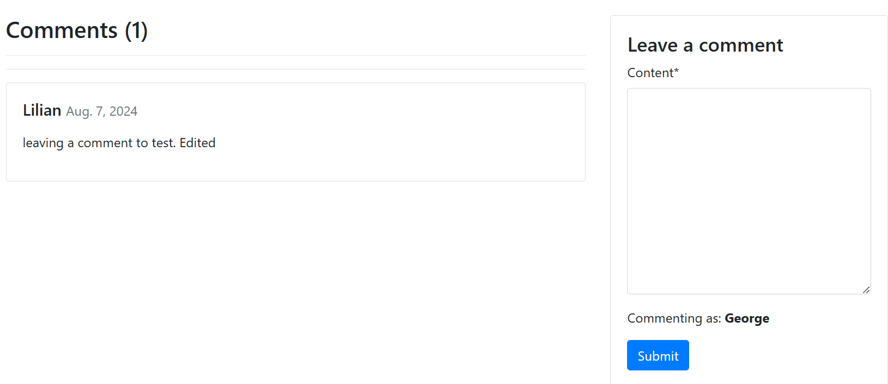

#### Responsive Navigation Bar

  - The navigation bar provides easy access to all sections of the site, adjusts for different screen sizes, and includes user authentication options.

  

#### Create Category

  - Users can create new categories to add to the existing categories.

  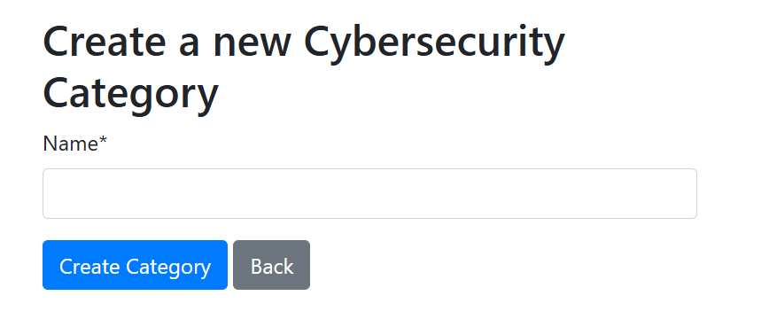

#### Likes

  - The Likes feature allows users to revisit posts they have liked. This feature encourages users to engage with content and authors they appreciate.

  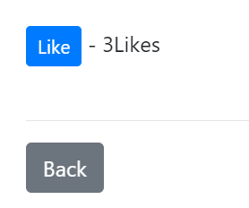

#### Pagination

  - Users can navigate through multiple pages of content seamlessly with pagination controls. This feature ensures that the website remains uncluttered and enhances user experience by dividing content into manageable and orderly sections. Users can easily move between pages using 'Previous' or 'Next'  links seen at the buttom of the posts.

  

#### Footer

  - The footer is consistent across the platform and offers additional navigation options, social media links, and legal information.

  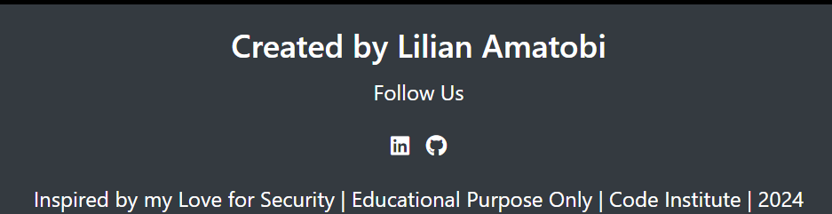

#### Admin Panel

  - Administrators have access to a backend panel where they can manage users, Cybersecurity posts, categories, and comments.

  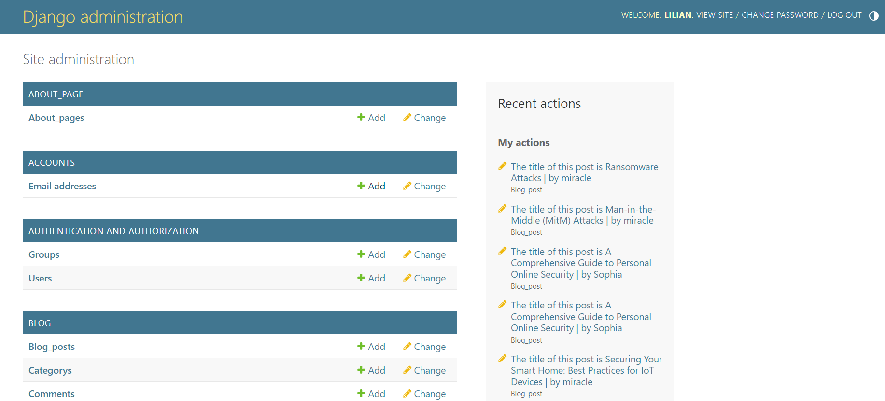

###  Functionality
Cybersecurity Mindset is a platform that allow users to engage with content across various Cybersecurity domains. Below is a table highlighting its features, detailing the level of access for registered up and unregistered users, and the CRUD (Create, Read, Update, Delete) functionalities available:

| Feature                   | registered User Access   |   UnRegistered User Access     | CRUD Functionality               |
|---------------------------|--------------------------|--------------------------------|----------------------------------|
| **Landing Page**          | Viewable                 | Viewable                       | Read                             |
| **Sign up**               | Unavailable              | Available                      | Create                           |
| **Login**                 | Unavailable              | Available                      | Create/Read                      |
| **Browse Posts**          | Viewable                 | Viewable                       | Read                             |
| **Create Category**       | Available                | Unavailable                    | Create                           |
| **Read More**             | Full Access (like,comment)| Limited Access                | Read/Create/Update/Delete        |
| **Comment on Posts**      | Available                | Unavailable                    | Create/Read/Update/Delete        |
| **Create New Post**       | Available                | Unavailable                    | Create                           |
| **Edit/Delete Post**      | Available  (Own Posts)   | Unavailable                    | Update/Delete                    |
| **Like Posts**            | Available                | Unavailable                    | Create                           |
| **About**                 | Viewable                 | Viewable                       | Read                             |
| **Comment on Posts**      | Available                | Unavailable                    | Create/Update/Delete             |
| **Contact**               | Available                | Available                      | Read                             |
| **Search**                | Available                | Available                      | Read                             |

## Features remaining to implement
Due to time constraints, the following features are remaining to implement
- The update and delete functionality for create category poage.
Hero Section:
- The Featured Articles Slider Highlights the latest or most important posts.
- The Search Bar is Prominent and centrally located for easy access.

## Technologies Used
### Frontend
- [**HTML5**](https://developer.mozilla.org/en-US/docs/Web/Guide/HTML/HTML5): Used for the web Structures.
- [**CSS3**](https://developer.mozilla.org/en-US/docs/Web/CSS): For Styling some of the web content.
- [**Bootstrap**](https://getbootstrap.com/): Responsive design and layout framework.

## Backend
- [**Django**](https://www.djangoproject.com/): A high-level Python web framework.
- [**Python**](https://www.python.org/): Backend programming language.
- [**SQLite**](https://www.sqlite.org/index.html) (Development) 
- [**PostgreSQL**](https://www.postgresql.org/) (Production): Database systems.

## Deployment and Version Control
- [**Git**](https://git-scm.com/): Used for version control.
- [**GitHub**](https://github.com/): Hosts the repository and facilitates version control and collaboration.
- [**Heroku**](https://www.heroku.com/): Platform as a service (PaaS) for deploying applications.
-  **Setting up on Heroku:**
    1. Create a new app on Heroku.
    2. Connect the Heroku app to the GitHub repository.
    3. Set up Config Vars in Heroku including `DATABASE_URL`, `SECRET_KEY`, `CLOUDINARY_URL`, `DISABLE_COLLECTSTATIC`, (this is temporary, and can be removed for the final deployment) etc.
    4. Deploy the main branch using the Heroku dashboard or enable automatic deployments for every push to the main branch.
**For deployment Heroku needs two additional files in order to deploy properly.**
- requirements.txt
- Procfile
  
You can install this project's requirements (where applicable) using:

- **pip3 install -r requirements.txt**

If you have your own packages that have been installed, then the requirements file needs updated using:

- **pip3 freeze --local > requirements.txt**

**The Procfile can be created with the following command:**

echo web: gunicorn app_name.wsgi > Procfile
replace app_name with the name of your primary Django app name; the folder where settings.py is located

## Development Tools
- [**GitPod**](https://www.gitpod.io/): Preferred IDE for writing and editing code.

## Libraries and Frameworks

- **asgiref (3.8.1)**: Supports asynchronous capabilities in Django, enabling better performance for asynchronous apps.
- **cloudinary (1.36.0)**: Manages cloud-based image and video storage and optimizations, integrating seamlessly with web applications for media management.
- **crispy-bootstrap5 (0.7)**: Allows Django forms to be styled effortlessly with Bootstrap 5, enhancing form presentation without extensive front-end coding.
- **dj-database-url (0.5.0)**: Simplifies database configuration using a URL scheme, which is especially useful for deployments on platforms like Heroku.
- **dj3-cloudinary-storage (0.0.6)**: Integrates Django projects with Cloudinary for handling static and media files storage.
- **Django (4.2.11)**: The main web framework for the project, providing the necessary tools to build a secure, scalable, and maintainable web application.
- **django-allauth (0.57.2)**: Adds authentication, registration, and account management capabilities, supporting both traditional and social authentication methods.
- **django-bootstrap4 (24.1)**: Facilitates the use of Bootstrap 4 in Django templates for consistent and responsive design across the application.
- **django-crispy-forms (2.1)**: Helps in rendering Django forms in a DRY (Don't Repeat Yourself) manner, allowing form styling through template packs.
- **django-summernote (0.8.20.0)**: Provides a rich text editor for Django forms, enhancing text input fields with WYSIWYG editing capabilities.
- **gunicorn (20.1.0)**: Serves as a Python WSGI HTTP Server for UNIX, enabling Django apps to handle more concurrent traffic.
- **oauthlib (3.2.2)**: A generic implementation of OAuth for sharing authentication across services, used in conjunction with django-allauth.
- **psycopg2 (2.9.9)**: Acts as a PostgreSQL database adapter for Python, essential for database operations in Django projects using PostgreSQL.
- **PyJWT (2.8.0)**: A Python library for encoding, decoding, and verifying JSON Web Tokens (JWT), useful for stateless authentication mechanisms.
- **python3-openid (3.2.0)**: Supports Python 3 applications in implementing OpenID authentication, often used in conjunction with django-allauth.
- **requests-oauthlib (2.0.0)**: Combines the power of the `requests` library with `oauthlib` for OAuth 1 and OAuth 2 authentication of requests.
- **sqlparse (0.4.4)**: A non-validating SQL parser for Python, which provides formatting and syntax analysis for SQL scripts used within Django.
- **urllib3 (1.26.18)**: A powerful HTTP client for Python, used for making HTTP requests in various parts of the application.
- **whitenoise (5.3.0)**: Simplifies static file management in Django by allowing the app to serve its own static files, improving performance and reducing complexity in production setups.

## Validation Tools
- [**W3C Markup Validation Service**](https://validator.w3.org/): For validating HTML5 code.
- [**W3C CSS Validation Service**](https://jigsaw.w3.org/css-validator/): For validating CSS3 code.
- [**JSHint**](https://jshint.com/): A tool that helps to detect errors and potential problems in JavaScript code.
- [**CI Python Linter**](https://pep8ci.herokuapp.com/): Analyzes Python code to look for bugs and signs of poor quality.
- [**Google Lighthouse**](https://developers.google.com/web/tools/lighthouse): For auditing performance, accessibility, and search engine optimization of web pages.

## Others
## Cloudinary
- [**Cloudinary**](https://cloudinary.com/): An end-to-end image and video management solution.
- **Media Storage:** Cloudinary is used for hosting media files like images. It removes the load of serving static files from Heroku, 
  ensuring better performance and scalability.
  - **Integration:**
    1. Set up a Cloudinary account.
    2. Configure the Cloudinary settings in the Django settings file with the API keys provided by Cloudinary.
    3. Use Django’s storage backend for Cloudinary to handle media uploads.

- [**Favicon.io**](https://favicon.io/): To generate favicon icons for the website.
- [**Font Awesome**](https://fontawesome.com/): Provides icons for enhancing UI/UX.
- [**Tiny Png**](https://tinypng.com/): To compress the images.
- [**Free Convert**](https://www.freeconvert.com/): To convert PNG, JPG, JPEG...images to Webp format.

## Testing

# Cloning and Forking
## Cloning the Repository
- **Local Setup:**
  1. Clone the repository: [GitHub repository](https://github.com/Adimserious/cyber-security-blog). 
 `git clone https://github.com/Adimserious/cyber-security-blog.
  2. Navigate into the project directory: `cd cybersecurity mindset`
  3. Install dependencies: `pip install -r requirements.txt`
  4. Set up local environment variables in a `.env` file.
  5. Run migrations: `python manage.py migrate`
  6. Start the development server: `python manage.py runserver`

## Forking the Repository
- **For Contributions:**
  1. Fork the repository on [GitHub repository](https://github.com/Adimserious/cyber-security-blog).
  2. Clone your forked repository to your local machine.
  3. Follow the local setup steps as above.
  4. Make changes and push them back to your fork.
  5. Create a pull request from your fork back to the original repo.

# Credits
## Code

The following blogs/tutorials complemented my learning for this project:

- [Django Docs](https://www.djangoproject.com/)
- [Bootstrap Docs](https://getbootstrap.com/docs/5.3/getting-started/introduction/)
- [StackOverflow](https://stackoverflow.com/questions/26185687/you-are-trying-to-add-a-non-nullable-field-new-field-to-userprofile-without-a)
- [Codemy.com/youtube](https://www.youtube.com/watch?v=B40bteAMM_M&list=PLCC34OHNcOtr025c1kHSPrnP18YPB-NFi)
- [NetNinja/youtube](https://www.youtube.com/watch?v=n-FTlQ7Djqc&list=PL4cUxeGkcC9ib4HsrXEYpQnTOTZE1x0uc)

## Media

The following sites were used to gather the photographic media used:
- [Pixabay](https://pixabay.com/)

## Additional reading/tutorials/books/blogs

- [Codeinstitute] PP4 walkthrough projects.
- [Chatgpt](https://chatgpt.com/) for blog post contents
- [software-stack](https://github.com/SwathiKeshavamurthy/SoftwareStacks-P4/blob/main/README.md) for readme inspiration 

## Acknowledgements
- Many thanks to **my husband and children** for their continued support and time when i needed extra time to study
- Thank you to my Code Institute mentor **Mitko** for his positive support, guidance and advice.
- Thanks to **Kristyna**, Cohort facilitator at Code Institute how she always there to give all the infromation needed to keep the positive energy.
- Thanks to my **fellow students and slack community** for constantly inspiring and being there for each other to help in trouble.
- Many Thanks to code institude tutor support, expecially Sarah. you all are amazing.
