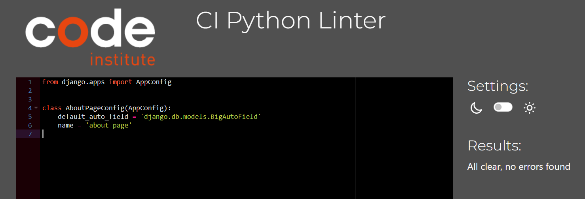

# Testing

This is the TESTING file for the [Cybersecurity Minset](https://cybersecurity-blog-c42a16cdf7ab.herokuapp.com/)

Return back to the [README.md](README.md) file.

- [Testing](#testing)
  - [Testing  Table of Contents](#testing--table-of-contents)
  - [Validation](#validation)
      - [HTML Validation](#html-validation)
      - [CSS Validation](#css-validation)
      - [Python Validation](#python-validation)
      - [Lighthouse Scores](#lighthouse-scores)
  - [Manual Testing](#manual-testing)
    - [User Input/Form Validation and Django Messages Implementation Testing](#user-input/form-validation-and-django-messages-implementation-testing)
    - [User Story Testing](#user-story-testing)
    - [Other Testing](#Other-Testing)
  - [Automated Testing](#automated-testing)
    - [Running the Tests](#running-the-tests)
    - [Test Database](#test-database)
    - [Importance of Testing](#importance-of-testing)
  - [Bugs](#bugs)
    - [Solved Bugs](#solved-bugs)
    - [Known Bugs](#known-bugs)
    - [Unknown Bugs](#unknown-bugs)


## Validation
To ensure that the Cybersecurity Mindset meets its requirements and performs its intended functions correctly the following testing was carried out which focus on evaluating the final product to confirm that it meets the needs and expectations of the end-users.

#### HTML Validation
- **Tool Used:** [HTML W3C Markup Validator](https://validator.w3.org/)
- **Purpose:** Validates the HTML code of the application to ensure it is free from syntax errors and adheres to the standards set by the World Wide Web Consortium (W3C).
- **Process:** All HTML pages of the Cybersecurity Minset are checked through the W3C validator to identify and fix any markup errors or warnings.


**HTML Validation Results**
- **Errors** are the actual HTML issues that need to be fixed as they may affect the functionality or appearance of the website.
- **Warnings** are generally suggestions for best practices, which are not critical but could improve the code efficiency or accessibility.


I tried to fix this bug but couldn't see where its coming from then i learnt that its coming from summernote, i could not fix the errors yet.


These ones has no errors.


I couldn't find where the trailing slash info is coming from.


#### CSS Validation
- **Tool Used:** [W3C CSS Validator](https://jigsaw.w3.org/css-validator/)
- **Purpose:** Ensures that the CSS code used across the platform adheres to the standards set by the W3C and is free of errors.
- **Process:** The CSS files are submitted to the W3C CSS Validator. Corrections are made based on feedback to improve performance and cross-browser compatibility.


#### Python Validation
- **Tool Used:** [CI Python Linter](https://pep8ci.herokuapp.com/#)
- **Purpose:** Analyzes Python source code to identify coding errors, enforce a coding standard, and look for code smells.
- **Process:** Python code within Cybersecurity Mindset is analyzed with Pylint to ensure adherence to coding standards and to improve code quality.

- Cybersecurity Project Module Python Validation Results**

**settings.py** i encountered new bugs after testing for the settings.py file and had to reverse to the previous code before testing.


**manage.py**


**asgi.py**


**wsgi.py**


**urls.py**


Blog Module Python Validation Results

**views.py**


**models.py**


**forms.py**


**urls.py**


**admin.py**


**apps.py**


About_page Module Python Validation Results

**views.py**


**models.py**


**urls.py**


**admin.py**


**apps.py**


Contact Module Python Validation Results

**views.py**


**models.py**


**forms.py**


**urls.py**


**admin.py**


**apps.py**


#### Lighthouse Scores
- **Tool Used:** [Google Lighthouse](https://en.wikipedia.org/wiki/Google_Lighthouse)
- **Purpose:** To assess the quality of web pages in terms of performance, accessibility, progressive web apps, SEO, and best practices.
- **Process:** Cybersecurity Mindset is tested with Google Lighthouse, which provides a detailed report on various aspects of the site’s performance and offers recommendations for improvement.

**Home Page**


**Create Post**


**Create Category**


**Sign Out**


**Search**


**About Page**


**Contact Page**


**Sign In**

**Sign up**


## Manual Testing

### User Input/Form Validation and Django Messages Implementation Testing

| Feature            | Tested? | Action        | Expected Outcome | Pass/Fail | Screenshots |
|--------------------|---------|---------------|------------------|-----------|-------|
| Sign up Form  | Yes     | Submit form   | User receives confirmation message and is redirected to the Home page as a login user. | Pass      |      |
| Login Form         | Yes     | Submit credentials | User is logged in and redirected to the homepage just like the sign up. | Pass      |      |
| Create Post Form          | Yes     | Creates post   | Post is created and submitted for review | Pass      |      |
| Contact Form  | Yes     | Submit form   | User receives confirmation message  | Pass      |      |
| Comment Form       | Yes     | Submit comment | Comment is added to the post and is awaiting approval | Pass      |      |
| Create category Form       | Yes     | Submit new category | Category is added to existing ones. | Pass      |      |
| Sign outpage       | Yes     | Sign user out | User is signed out successfully. | Pass      |      |
|No Access to Editing Others Post       | Yes     | Takes user to the homepage | Message of no permission is shown. | Pass      |      |
|No Access to Editing Others Category       | Yes     | Takes user to the homepage | Message of no permission is shown. | Pass      |      |


**User Input**

| Feature                               | Tested? | User Input Required           | User Feedback Provided                                                          | Pass/Fail | Notes on Fix (If Any) |
|---------------------------------------|---------|------------------------------|--------------------------------------------------------------------------------|-----------|----------------------|
| Navigation Links                      | Yes     | Click                        | Links redirect to corresponding pages. Hover effects indicate interactivity.    | Pass      | -                    |
| Home Page Posts                     | Yes     | Click                        | Clicked on posts take users to read more of posts. | Pass      | -                    |
| Sign Up Page                          | Yes     | Username/Password/Again Password/Email(optional)    | Validation prompts for incorrect input. Success message on account signup.    | Pass      |                   |
| Login Page                            | Yes     | Username and Password  | Correct credentials required for login. Error message for failed login attempt. | Pass      | -                    |
| Add Post and Submission                    | Yes     | Text/Image Upload            | Mandatory fields checked. Confirmation message upon successful submission.       | Pass      |                    |
| Comment Submission                    | Yes     | Text Input                   | Users can submit comments. Awaiting approval message displayed.               | Pass      | -                    |
| Like Interaction             | Yes     | Click                        | No Visual feedback on like however, Counts update accordingly.                    | Pass      | -                    |
| Search Functionality                  | Yes     | Text Input                   | Relevant search results displayed. Message for no results found and suggestion for a new search seen.                 | Pass      | -                    |
| Contact Us Form Submission            | Yes     | Text Input                   | Contact details of the user is submitted.       | Pass      | -                    |
| Pagination Controls                   | Yes     | Click                        | Users can navigate through pages of posts.                                       | Pass      | -                    |
| Post read more Interaction               | Yes     | Click on various elements    | Detailed view of post with comments and like options.                  | Pass      | -                    |                       | Pass      | -                    |
| Form Error Handling                   | Yes     | Invalid Inputs               | Forms handle errors with descriptive messages guiding the user.                  | Pass      | -                    |
| Logout Functionality                  | Yes     | Click                        | Users can log out successfully with a confirmation message.                      | Pass      | -                    |
| Footer Social Media Icons             | Yes     | Click                        | Social media icons link to external pages in a new tab.                          | Pass      | -                    |
| Responsive Design Elements            | Yes     | Resize/Change Orientation    | All elements resize and post appropriately for different screen sizes.          | Pass      | -                    |
| Accessibility Features (e.g., ARIA)   | Yes     | Use of assistive technology  | ARIA labels and roles are present, ensuring accessibility compliance.            | Pass      | -                    |


### User Story Testing

| User Story ID | Title | Tested? | Response | Acceptance Criteria | Pass/Fail |
|---------------|-------|---------|----------|---------------------|-----------|
| #4 | view paginated post lists | Yes | No issues | User can browse the site without the need to log in | Pass |
| #5 | Open a Blog Post | Yes | No issues | Users can open and read posts | Pass |
| #6 | View comments | Yes | No issues | Comments are visible under posts | Pass |
| #7 | comment on a post | Yes | No issues | Users can comment on posts | Pass |
| #8 | Account Registration | Yes | No issues | Users can register for an account | Pass |
| #9 | Modify or delete comment on a post | Yes | No issues | Users can Modify and delete comment on a post | Pass |
| #10 | Manage posts | Yes | No issues | Logged in Users can Manage blog posts (create, edit, delete) | Pass |
| #11 | Create drafts | Yes | No issues | Users can create drafts posts | Pass |
| #12 | Data validation | Yes | No issues | Users can only use valid inputs | Pass |
| #13 | User-Login | Yes | No issues | registered user can is able to login. | Pass |
| #14 | Like post | Yes | No issues | Users can like blog posts | Pass |
| #15 | Edit blog post | Yes | No issues | Users can edit their posts | Pass |
| #16 | Delete Blog Post | Yes | No issues | Authors can delete their blog posts | Pass |
| #17 | Category | Yes | No issues | Users can choose to categorise their posts | Pass |
| #18 | About | Yes | No issues | Users can view the about page | Pass |
| #19 | Contact | Yes | No issues | Users can submit contact forms | Pass |
| #20 | Create-Post | Yes | No issues | Users can create and publish blog posts | Pass |


### Other Testing

| NO | Title | Tested? | Response | Acceptance Criteria | Pass/Fail |
|---------------|-------|---------|----------|---------------------|-----------|
| 1 | Facilitate Removal of Outdated or Incorrect Posts | Yes | No issues | Users can delete outdated or incorrect posts | Pass |
| 2 | Navigate easily | Yes | No issues | Users can navigate the site easily using navigation links | Pass |
| 3 | 'Sign up' and 'Log in' buttons disappear after 'Login' | Yes | No issues | After logging in, sign up and login buttons are not replaced to user | Pass |
| 4 | Create new apps  | Yes | No issues | Developers can create new applications within the project | Pass |
| 5 | Cyber Security Mindset Blog | Yes | No issues | Users can access and interact with blog posts | Pass |
| 6 | Deploying the Django Project on Heroku | Yes | No issues | The project is successfully deployed on Heroku | Pass |
| 7 | Creating the Database in ProsgresSQL | Yes | No issues | The database is successfully created and managed using ProsgresSQL | Pass |
| 8 | Add and update the about text | Yes | No issues | Admins can add and update the about page content | Pass |
| 9 | Implement Comprehensive Testing | Yes | No issues | Comprehensive testing is carried out across the application | Pass |
| 10 | Contact Form Submission Feature(Site Owner) | Yes | No issues | Site owner can receive and respond to contact submissions | Pass |
| 11 | Enhance Data Validation | Yes | No issues | Data validation mechanisms are in place and functional | Pass |


## Automated Testing
I am not able to complete automated testing in the Cybersecurity Mindset Blog.

### Running the Tests

To run the automated tests for Cybersecurity Minset, follow these steps:

1. Open your terminal or command prompt.
2. Navigate to the root directory of the project where the `manage.py` file is located.
3. Execute the following command:
   ```bash
   python manage.py test
   ```
   This command will initiate the Django test runner, which will find and run tests written throughout the project.


### Test Database

During testing, Django creates a separate database to ensure that the tests do not interfere with the production or development database. This test database is created before the tests run and is destroyed once the tests have completed. This process ensures that the testing environment is isolated and consistent.


### Importance of Testing

Automated tests help us to:
- Quickly detect and fix bugs.
- Ensure that new features integrate seamlessly without breaking existing functionality.
- Improve code quality and maintainability.
- Build confidence in the stability of the application.


## Bugs

### Solved Bugs
The background image wouldn't show in the deployed site and i was stucked findind solution to it untill i downloaded the image on cloudinary and used the image url in the stylesheet.

### Known Bugs
I am not aware of any known bugs so far.
