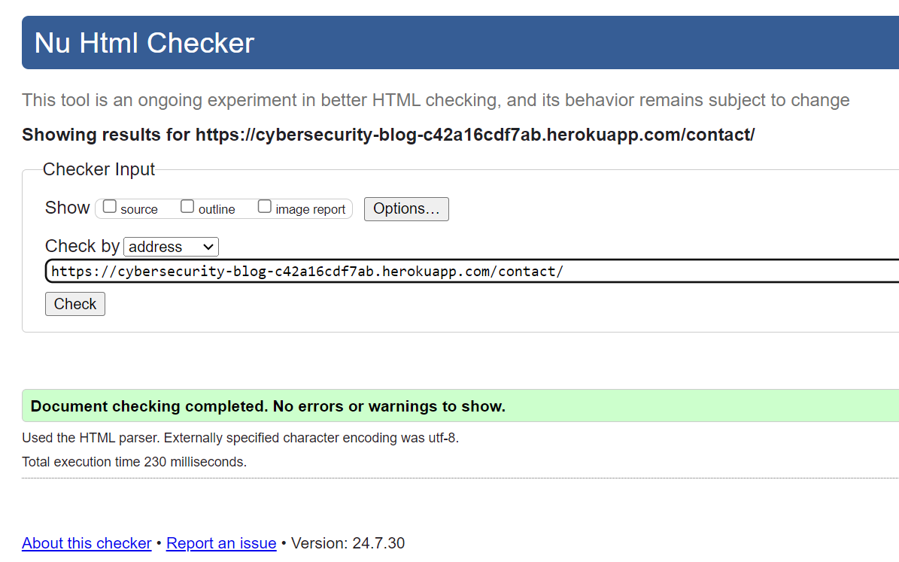
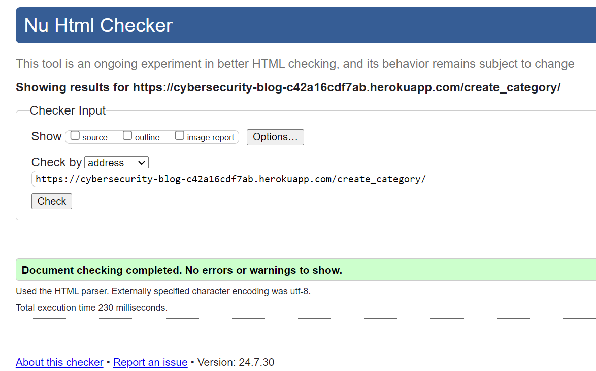

# Testing

This is the TESTING file for the [Cybersecurity Minset](https://cybersecurity-blog-c42a16cdf7ab.herokuapp.com/)

Return back to the [README.md](README.md) file.

- [Testing](#testing)
  - [Testing  Table of Contents](#testing--table-of-contents)
  - [Validation](#validation)
      - [HTML Validation](#html-validation)
      - [CSS Validation](#css-validation)
      - [Python Validation](#python-validation)
      - [CSS Validation](#css-validation-1)
      - [Lighthouse Scores](#lighthouse-scores)
      - [Wave Accessibility Evaluation](#wave-accessibility-evaluation)
  - [Manual Testing](#manual-testing)
    - [User Input/Form Validation](#user-inputform-validation)
    - [Browser Compatibility](#browser-compatibility)
    - [Django Messages Implementation Testing](#django-messages-implementation-testing)
    - [User Story Testing](#user-story-testing)
    - [Responsiveness - Dev Tools/Real World Device Testing](#responsiveness---dev-toolsreal-world-device-testing)
  - [Automated Testing](#automated-testing)
    - [Running the Tests](#running-the-tests)
    - [Test Database](#test-database)
    - [Importance of Testing](#importance-of-testing)
    - [Continuous Integration](#continuous-integration)
  - [Bugs](#bugs)
    - [Solved Bugs](#solved-bugs)
    - [Known Bugs](#known-bugs)
    - [Unknown Bugs](#unknown-bugs)


## Validation
To ensure that the Cybersecurity Mindset meets its requirements and performs its intended functions correctly the following testing was carried out which focus on evaluating the final product to confirm that it meets the needs and expectations of the end-users.

#### HTML Validation
- **Tool Used:** [HTML W3C Markup Validator](https://validator.w3.org/)
- **Purpose:** Validates the HTML code of the application to ensure it is free from syntax errors and adheres to the standards set by the World Wide Web Consortium (W3C).
- **Process:** All HTML pages of the Cybersecurity Minset are checked through the W3C validator to identify and fix any markup errors or warnings.


**HTML Validation Results**
- **Errors** are the actual HTML issues that need to be fixed as they may affect the functionality or appearance of the website.
- **Warnings** are generally suggestions for best practices, which are not critical but could improve the code efficiency or accessibility.


I tried to fix this bug but couldn't see where its coming from then i learnt that its coming from summernote, i could not fix the errors yet.


These ones has no errors.







I couldn't find where the trailing slash info is coming from.


#### CSS Validation
- **Tool Used:** [W3C CSS Validator](https://jigsaw.w3.org/css-validator/)
- **Purpose:** Ensures that the CSS code used across the platform adheres to the standards set by the W3C and is free of errors.
- **Process:** The CSS files are submitted to the W3C CSS Validator. Corrections are made based on feedback to improve performance and cross-browser compatibility.


#### Python Validation
- **Tool Used:** [CI Python Linter](https://pep8ci.herokuapp.com/#)
- **Purpose:** Analyzes Python source code to identify coding errors, enforce a coding standard, and look for code smells.
- **Process:** Python code within Cybersecurity Mindset is analyzed with Pylint to ensure adherence to coding standards and to improve code quality.

- Cybersecurity Project Module Python Validation Results**

**settings.py**


**manage.py**


**asgi.py**


**wsgi.py**


**urls.py**


Blog Module Python Validation Results

**views.py**


**models.py**


**forms.py**


**urls.py**


**admin.py**


**apps.py**


About_page Module Python Validation Results

**views.py**


**models.py**


**urls.py**


**admin.py**


**apps.py**


Contact Module Python Validation Results

**views.py**


**models.py**


**forms.py**


**urls.py**


**admin.py**


**apps.py**


#### Lighthouse Scores
- **Tool Used:** [Google Lighthouse](https://en.wikipedia.org/wiki/Google_Lighthouse)
- **Purpose:** To assess the quality of web pages in terms of performance, accessibility, progressive web apps, SEO, and best practices.
- **Process:** Cybersecurity Mindset is tested with Google Lighthouse, which provides a detailed report on various aspects of the site’s performance and offers recommendations for improvement.

**Home Page**


**Create Post**


**Create Category**


**Sign Out**


**Search**


**About Page**


**Contact Page**


**Sign In**

**Sign up**


#### Wave Accessibility Evaluation
- **Tool Used:** [Wave Web Accessibility Evaluation Tool](https://wave.webaim.org/)
- **Purpose:** To ensure that the website is accessible to individuals with disabilities by identifying and suggesting fixes for web accessibility issues.
- **Process:** The Wave tool evaluates each page of Cybersecurity Mindset to ensure it complies with accessibility standards like WCAG and Section 508.

![Wave Web Accessibility Evaluation Tool]


## Manual Testing

### User Input/Form Validation


### Browser Compatibility

### Django Messages Implementation Testing

### User Story Testing

### Responsiveness - Dev Tools/Real World Device Testing

## Automated Testing


### Running the Tests

To run the automated tests for Cybersecurity Minset, follow these steps:

1. Open your terminal or command prompt.
2. Navigate to the root directory of the project where the `manage.py` file is located.
3. Execute the following command:
   ```bash
   python manage.py test
   ```
   This command will initiate the Django test runner, which will find and run tests written throughout the project.


### Test Database

During testing, Django creates a separate database to ensure that the tests do not interfere with the production or development database. This test database is created before the tests run and is destroyed once the tests have completed. This process ensures that the testing environment is isolated and consistent.


### Importance of Testing

Automated tests help us to:
- Quickly detect and fix bugs.
- Ensure that new features integrate seamlessly without breaking existing functionality.
- Improve code quality and maintainability.
- Build confidence in the stability of the application.


## Bugs

### Solved Bugs
The background image wouldn't show in the deployed site and i was stucked findind solution to it untill i downloaded the image on cloudinary and used the image url in the stylesheet.

### Known Bugs
The search function shows displays search results or not accordingly, however the links doesn't take user to the individual post, i couldn't go further to finding solutions to this due to limited time.

### Unknown Bugs
I am not aware of any unknown bugs so far.
